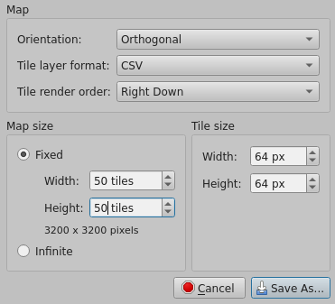

# Pirates

## Client

Standard Vanilla Typescript SPA built with webpack.

- `npm run build` - runs webpack in watch mode to compile `src` into `dist`. Server serves `dist` to users

## Server

Standard NodeJS environment

- `npm run build` - build a dist folder
- `npm start` - runs the `index.ts` in nodejs

`.env` provides default values for environment variables.

## Protocol

All type definitions are stored under `/shared`. Server delivers client to user. Client sends post request to `/join` to join game server, and connects via WebSocket to the address returned by the server.

## Maps

Maps are created with [Tiled](https://thorbjorn.itch.io/tiled). Use the `pirates.tsx` tileset and create a map of any set size with the following settings:

Size is optional. Server will merge all layers into terrain for world. Load the `.tmx` file into the server. Pirates does not support rotation at this time.

Maps have a corresponding .json file that includes crew options, ports, and other configurations for the map.

## Bucket List

- Emotes
- Quests
- AI Ships
- Clans
  - Global Clan Score
  - Clan territory
  - Clan war
  - Clan rank
- Skins?
  - Unlock emotes?
  - Unlock skins?
  - Sound Emotes?
- Private Servers?
- Web RTC with players nearby?

## Running Locally

`docker run -p 8081:8081 -d --rm -ePORT=8081 -eURL=127.0.0.1 joshgrift/pirates:latest`

### Docker Tags:

- `latest` - Latest release
- `next` - Latest push the master

## Acknowledgements

- Ship/Terrain Assets - [Kenney.nl](https://kenney.nl/assets/pirate-pack)
- Building Assets - [Kenney.nl](https://kenney.nl/assets/medieval-rts)
- Emotes - [Kenney.nl](https://kenney.nl/assets/emotes-pack)
- Font - [dtinth](https://dtinth.github.io/comic-mono-font/)
- Inventory Items - [cheekyinkling (Shikashis)](https://cheekyinkling.itch.io/shikashis-fantasy-icons-pack)
- Characters - [illustmaker](https://illustmaker.abi-station.com/index_en.shtml)
- Map Builder - [Tiled](https://www.mapeditor.org/download.html)
